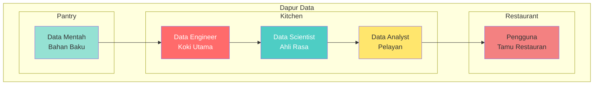
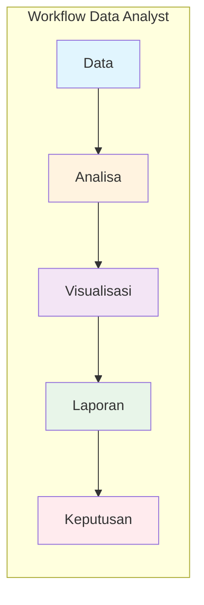
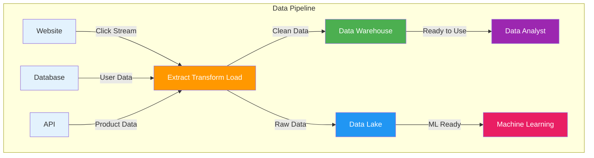
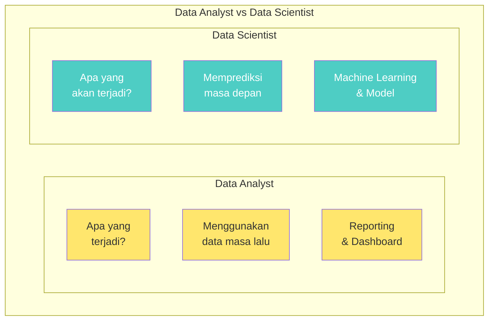
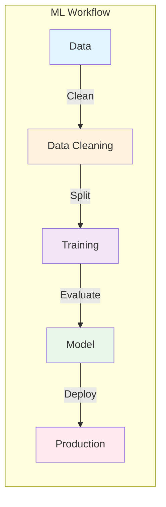
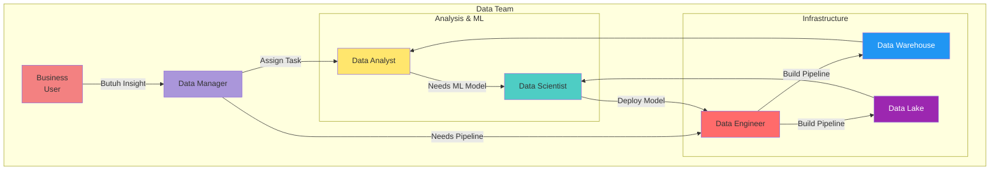
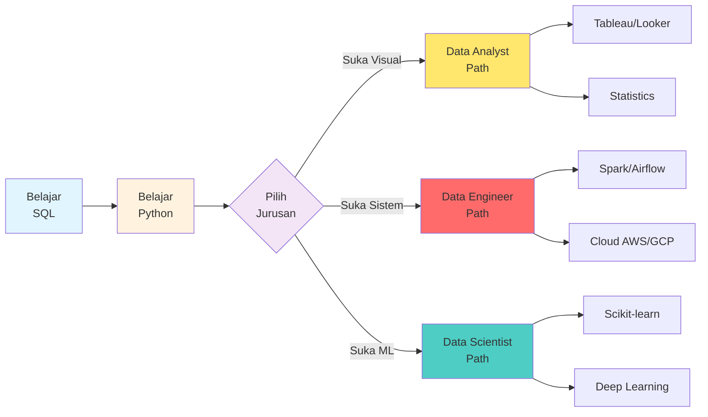

# Data Analyst, Data Engineer, dan Data Science: Siapa Mereka?

Di dunia data, ada tiga peran utama yang sering terdengar: Data Analyst, Data Engineer, dan Data Scientist. Tapi apa bedanya? Siapa yang melakukan apa? Tenang, artikel ini akan menjelaskan dengan bahasa semudah mungkin!

## Bayangkan Seperti Dapur Restauran

Sebelum masuk ke details, bayangkan dunia data seperti dapur sebuah restoran:

- **Data Engineer** = Koki yang mempersiapkan bahan
- **Data Scientist** = Ahli rasa yang menciptakan resep
- **Data Analyst** = Pelayan yang menyajikan makanan ke tamu

---

## Apa Itu Data Analyst?

Data Analyst adalah orang yang tugasnya "menceritakan cerita" dari data. Mereka mengambil data yang sudah ada dan mengubahnya menjadi informasi yang bisa dipahami orang lain.

### Contoh Kerja Sehari-Hari

Bayangkan kamu punya tokopedia online. Sebagai Data Analyst, kamu mungkin akan:

- "Berapa banyak yang terjual hari ini?"
- "Produk mana yang paling banyak dibeli?"
- "Dari mana saja pelanggan kita?"

### Alat Yang Digunakan

| Alat | Fungsi |
|------|--------|
| **Excel** | Analisa sederhana |
| **SQL** | Mengambil data dari database |
| **Tableau** | Membuat grafik interaktif |
| **Power BI** | Dashboard bisnis |
| **Python/R** | Analisa lanjutan |

### Keterampilan Yang Dibutuhkan

- **Matematika dasar** - Tidak perlu jago calculus, cukup paham persentase dan rata-rata
- **SQL** - Untuk mengambil data
- **Visualisasi** - Membuat grafik yang menarik
- **Komunikasi** - Menceritakan findings ke orang lain

---

## Apa Itu Data Engineer?

Data Engineer adalah orang yang membangun "infrastruktur data". Mereka memastikan data bisa mengalir dengan顺畅 dari satu tempat ke tempat lain.

### Bayangkan Seperti...

Data Engineer membangun jalan tol untuk data. Tanpa mereka, data Analyst tidak bisa bekerja dengan baik!

### Contoh Kerja Sehari-Hari

- "Buat pipeline agar data dari website masuk ke database"
- "Pastikan data dari semua sources bisa digabungkan"
- "Optimasi kecepatan query agar analyst bisa kerja cepat"

### Alat Yang Digunakan

| Alat | Fungsi |
|------|--------|
| **Python** | Bahasa pemrograman utama |
| **Apache Spark** | Memproses data besar |
| **Airflow** | Mengatur workflow data |
| **Snowflake/BigQuery** | Data warehouse cloud |
| **Docker/Kubernetes** | Containerisasi |

### Keterampilan Yang Dibutuhkan

- **Pemrograman** - Python, Scala, Java
- **SQL** - Untuk manipulasi data
- **Cloud** - AWS, GCP, Azure
- **System design** - Membangun sistem yang scalable

---

## Apa Itu Data Scientist?

Data Scientist adalah orang yang "menemukan pola" dalam data dan membuat predictions. Mereka menggabungkan statistik, pemrograman, dan pengetahuan bisnis.

### Apa Bedanya dengan Data Analyst?

### Contoh Kerja Sehari-Hari

- "Buat model untuk memprediksi customer churn"
- "Rekomendasikan produk yang cocok untuk user"
- "Segmentasi customer berdasarkan perilaku"

### Alat Yang Digunakan

| Alat | Fungsi |
|------|--------|
| **Python** | Bahasa utama data science |
| **TensorFlow/PyTorch** | Deep learning |
| **Scikit-learn** | Machine learning klasik |
| **Jupyter Notebook** | Eksperimen & prototyping |
| **Statistics** | Ilmu di balik model |

### Keterampilan Yang Dibutuhkan

- **Statistik** - Pahami distribusi, hypothesis testing
- **Pemrograman** - Python, R
- **Machine Learning** - Regression, classification, dll
- **Domain knowledge** - Pahami bisnis yang dihadapi

---

## Perbandingan Langsung

| Aspek | Data Analyst | Data Engineer | Data Scientist |
|-------|--------------|---------------|-----------------|
| **Tujuan** | Insight dari data | Infrastruktur data | Prediksi dari data |
| **Output** | Laporan, Dashboard | Pipeline, ETL | Model ML |
| **Alat utama** | SQL, Tableau | Python, Spark | Python, TensorFlow |
| **Required Skills** | Komunikasi, Viz | Engineering, Cloud | Stats, ML |
| **Difficulty** | Beginner-friendly | Intermediate | Advanced |

---

## flowchart Peran-Peran Data Dalam Perusahaan

---

## Siapa Yang Harus Dipilih?

### Pilih Data Analyst jika:
- Kamu suka melihat grafik dan membuat laporan
- Kamu enjoy menjelaskan temuan ke orang lain
- Kamu baru belajar dunia data (starting point!)

### Pilih Data Engineer jika:
- Kamu suka building systems
- Kamu interess dengan cloud dan infrastructure
- Kamu sukaoptimasi dan performance

### Pilih Data Scientist jika:
- Kamu suka matematika dan statistik
- Kamu ingin membuat predictions
- Kamu siap belajar machine learning

---

## Mulai Dari Mana?

## Kesimpulan

Ketiga peran ini saling melengkapi dalam tim data:

- **Data Engineer** membangun fondasi
- **Data Scientist** menciptakan magic
- **Data Analyst** menyampaikan cerita

Tidak ada yang lebih baik dari yang lain! Semua penting dan semua punya tempat masing-masing.

Yang paling penting adalah memilih sesuai dengan passion danminat kamu. Mau mulai dari mana? Semua bisa dimulai dengan belajar SQL dan Python dasar!
