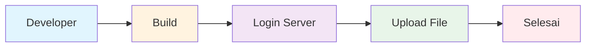
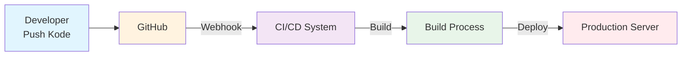
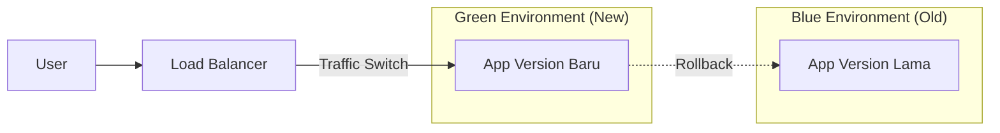
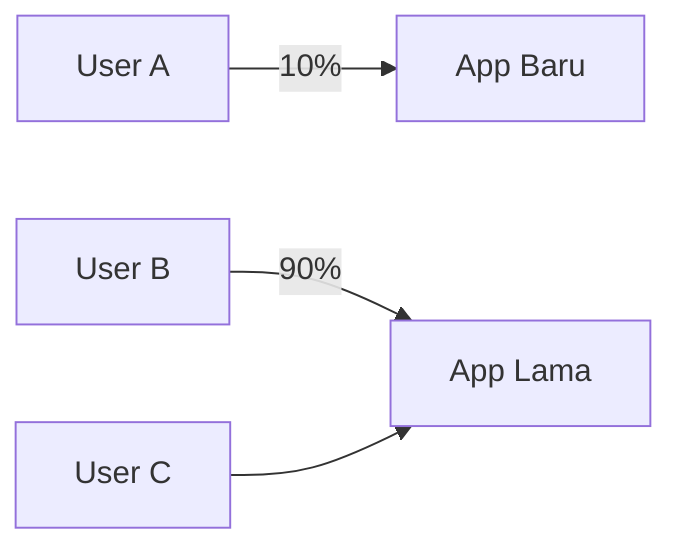
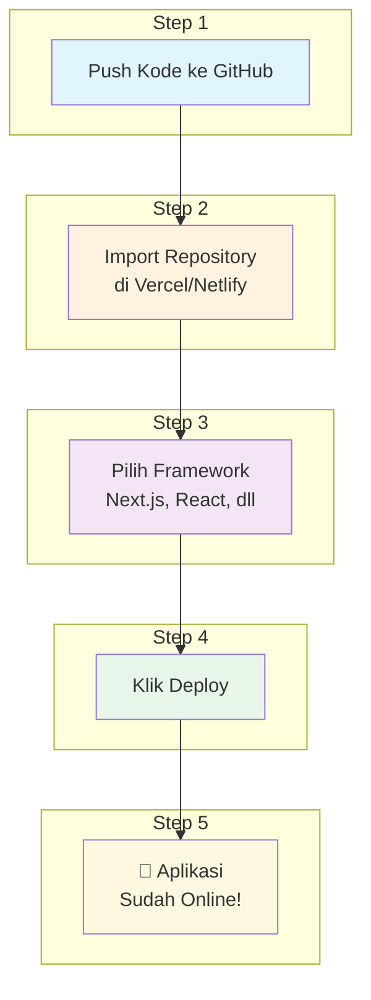
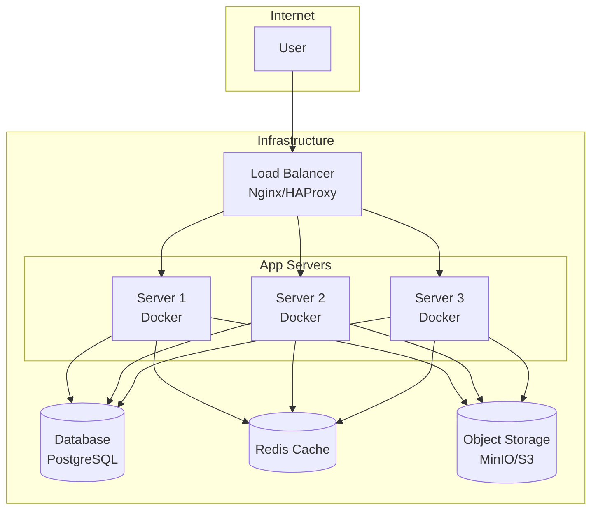
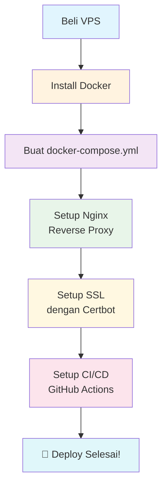
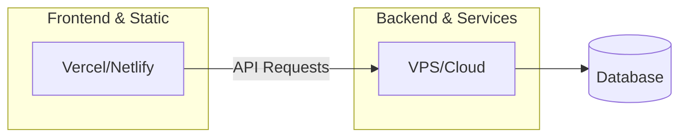

# Deploy Like a Pro: Managed vs Self-Hosted Explained

Deployment adalah salah satu istilah yang sering didengar dalam dunia pengembangan software. Tapi sebenarnya deployment itu apa sih? Kenapa harus deployment? Dan metode deployment yang mana yang harus kita pilih? Artikel ini akan membahas semua itu dengan bahasa yang mudah dipahami.

## Apa Itu Deployment?

Bayangkan kamu sudah selesai membuat sebuah aplikasi. Nah, supaya aplikasi itu bisa digunakan oleh orang lain, kamu perlu meletakkan aplikasi tersebut di tempat yang bisa diakses lewat internet. Proses menempatkan aplikasi dari lingkungan pengembangan ke lingkungan produksi (yang bisa diakses pengguna) inilah yang disebut deployment.

Jadi secara sederhana:

- **Development** = tempat kamu menulis dan mengetes kode
- **Production** = tempat aplikasi kamu "tinggal" dan bisa diakses orang lain
- **Deployment** = proses memindahkan aplikasi dari development ke production

## Jenis-Jenis Deployment

Dalam dunia nyata, ada beberapa cara melakukan deployment:

### 1. Manual Deployment

Ini cara paling sederhana. Developer selesai coding, lalu secara manual mengupload file ke server. Prosesnya bisa seperti ini:

Cara ini cocok untuk project sangat kecil atau belajar, tapi tidak efisien untuk project tim atau aplikasi yang sering di-update.

### 2. Continuous Deployment (CD)

Ini adalah deployment yang otomatis. Setiap kali ada perubahan kode yang di-push ke repository, sistem akan secara otomatis membangun dan men-deploy aplikasi. Tanpa harus ada yang Login ke server lagi.

### 3. Blue-Green Deployment

Bayangkan kamu punya dua ruangan identical (biru dan hijau). Aplikasi lama ada di ruangan biru. Kamu deploy aplikasi baru ke ruangan hijau. Setelah semua siap dan di-tes, kamu tinggal alihkan traffic dari biru ke hijau. Kalau ada masalah, tinggal alihkan kembali ke biru.

### 4. Canary Deployment

Ini seperti percobaan pertama dulu. Kamu deploy aplikasi baru ke sebagian kecil pengguna dulu. Kalau tidak ada masalah, baru di-rollout ke semua pengguna.

### 5. Rolling Deployment

Cara ini mengupdate server satu per satu. Jadi tidak semua server dimatikan sekaligus. Prosesnya bertahap dari server 1, terus server 2, dan seterusnya.

## Platform Managed vs Self-Hosted

Ini adalah pilihan utama yang sering membingungkan. Mari kita bahas satu per satu dengan detail.

### Platform Managed (Vercel, Netlify, Dll)

Platform managed adalah layanan yang menyediakan infrastruktur "siap pakai". Kamu tidak perlu repot-repot setup server. Cukup connect repository GitHub kamu, dan platform itu yang akan menangani semuanya.

#### Apa Saja yang Disediakan?

1. **Server** - Kamu tidak perlu beli atau setup VPS
2. **Auto-scaling** - Kalau traffic naik tiba-tiba, sistem akan menambah kapasitas secara otomatis
3. **CDN Global** - File aplikasi akan disimpan di banyak tempat di dunia, jadi loadingnya cepat dari mana saja
4. **SSL/HTTPS** - Gratis, tinggal klik saja
5. **CI/CD Otomatis** - Setiap kali push kode, otomatis build dan deploy
6. **Preview Deployments** - Setiap Pull Request akan mendapat URL preview sendiri
7. **Environment Variables** - Mengatur variabel lingkungan lewat dashboard

#### Cara Pakainya

Langkah-langkahnya sangat mudah:

#### Kelebihan Platform Managed

- **Mudah sekali** - Tidak perlu mengerti server
- **Cepat** - Dalam hitungan menit aplikasi sudah online
- **Zero maintenance** - Tidak perlu update server atau security patch
- **Fitur lengkap** - SSL, CDN, analytics sudah include

#### Kekurangan Platform Managed

- **Vendor lock-in** - Terikat dengan layanan tertentu, sulit pindah ke tempat lain
- **Cost untuk scale besar** - Kalau traffic sudah sangat besar, biaya bisa lebih mahal dari VPS sendiri
- **Kontrol terbatas** - Tidak bisa konfigurasi server secara mendalam
- **Cold starts** - Pada tier gratis, ada jeda kalau aplikasi idle

#### Kapan Pilih Platform Managed?

- Project kecil sampai menengah
- Ingin cepat launch
- Tim kecil tanpa DevOps
- MVP atau startup
- Aplikasi frontend atau static site

---

### Self-Hosted (VPS, Server Sendiri)

Self-hosted berarti kamu menyewa server sendiri dan mengelolanya sendiri. Kamu yang bertanggung jawab atas semua aspek: setup, keamanan, maintenance, dan scaling.

#### Arsitektur Self-Hosted

#### Tools yang Dibutuhkan

##### 1. Penyedia Server/VM

| Provider | Keterangan |
|----------|------------|
| **DigitalOcean** | VPS populer, harga terjangkau |
| **AWS EC2** | Skala besar, layanan lengkap Google |
| **GCP** | Cloud Platform |
| **Linode** | Alternatif DigitalOcean |
| **Hetzner** | Harga sangat murah (Jerman) |
| **Upcloud** | Performa tinggi |

##### 2. Container & Orchestration

| Tool | Fungsi |
|------|--------|
| **Docker** | Mengemas aplikasi bersama dengan semua dependencies |
| **Docker Compose** | Orkestrasi multi-container |
| **Kubernetes** | Orkestrasi untuk skala besar |
| **K3s** | Versi ringan Kubernetes untuk VPS |

##### 3. Web Server & Reverse Proxy

| Tool | Fungsi |
|------|--------|
| **Nginx** | Web server dan reverse proxy |
| **Caddy** | Auto HTTPS, konfigurasi sederhana |
| **Traefik** | Reverse proxy dengan auto-discovery |
| **HAProxy** | Load balancer tingkat lanjut |

##### 4. CI/CD Pipeline

| Tool | Fungsi |
|------|--------|
| **GitHub Actions** | CI/CD dari GitHub |
| **GitLab CI** | CI/CD dari GitLab |
| **Jenkins** | Open source, sangat fleksibel |
| **ArgoCD** | GitOps untuk Kubernetes |

##### 5. Database

| Tool | Tipe |
|------|------|
| **PostgreSQL** | Database relasional |
| **MySQL/MariaDB** | Database relasional |
| **Redis** | In-memory cache |
| **MongoDB** | NoSQL database |
| **MinIO** | Object storage (S3 compatible) |

##### 6. Monitoring

| Tool | Fungsi |
|------|--------|
| **Prometheus** | Mengumpulkan metrik |
| **Grafana** | Visualisasi dashboard |
| **Uptime Kuma** | Monitoring uptime |
| **Loki** | Agregasi log |

#### Step-by-Step Deployment Self-Hosted (Cara Sederhana)

#### Kelebihan Self-Hosted

- **Full kontrol** - Konfigurasi sesuai kebutuhan
- **Biaya lebih murah** - Untuk traffic besar, VPS lebih hemat
- **Fleksibilitas** - Install software apapun
- **Data privacy** - Data tersimpan di server sendiri
- **Tanpa batasan** - Tidak ada limit bandwidth atau build minutes

#### Kekurangan Self-Hosted

- **Complex** - Perlu belajar banyak hal baru
- **Maintenance** - Perlu waktu untuk update dan security patch
- **Scaling manual** - Perlu setup load balancer dan auto-scaling sendiri
- **Butuh expertise** - Memerlukan pengetahuan sysadmin

#### Kapan Pilih Self-Hosted?

- Butuh kontrol penuh atas infrastruktur
- Traffic sangat besar
- Ingin optimalisasi biaya jangka panjang
- Punya data sensitif (HIPAA, GDPR)
- Butuh software/environment khusus

---

## Perbandingan Langsung

| Aspek | Platform Managed | Self-Hosted |
|-------|------------------|-------------|
| **Setup awal** | 5 menit | 1-7 hari |
| **Maintenance** | 0 jam/bulan | 5-20 jam/bulan |
| **Cost (kecil)** | Gratis - $20/bln | $5-20/bln |
| **Cost (besar)** | Mahal | Lebih murah |
| **Scaling** | Auto | Manual/Perlu setup |
| **Debugging** | Terbatas | Full visibility |
| **Kontrol** | Terbatas | Penuh |
| **Learning curve** | Rendah | Tinggi |

## Cara Hybrid

Banyak tim menggunakan kombinasi keduanya:

Contoh:
- **Vercel/Netlify** untuk frontend dan preview apps
- **VPS/Cloud** untuk backend, database, dan services

## Memilih yang Tepat

Pertanyaan ini akan membantu kamu memilih:

1. **Seberapa besar traffic-nya?** 
   - Kecil (< 10.000 pengunjung/bulan) → Platform managed sudah cukup
   - Besar → Pertimbangkan self-hosted

2. **Berapa budget-nya?**
   - Tidak ada budget → Platform managed (tier gratis)
   - Budget terbatas tapi traffic besar → Self-hosted
   - Budget besar → Sesuai kebutuhan saja

3. **Seberapa penting kontrol?**
   - Tidak penting → Platform managed
   - Sangat penting → Self-hosted

4. **Seberapa besar tim?**
   - Tim kecil tanpa DevOps → Platform managed
   - Tim besar dengan DevOps → Self-hosted atau hybrid

5. **Jenis aplikasi apa?**
   - Static site / frontend → Platform managed
   - Backend kompleks → Self-hosted atau hybrid

## Kesimpulan

Deployment adalah proses penting dalam pengembangan software. Pilihan antara platform managed dan self-hosted tergantung pada banyak faktor: budget, skala, tim, dan kebutuhan spesifik.

Untuk pemula atau project kecil, platform managed seperti Vercel adalah pilihan yang sangat baik. Prosesnya mudah dan biaya awalnya gratis.

Untuk aplikasi besar dengan traffic tinggi, atau tim yang sudah memiliki keahlian DevOps, self-hosted memberikan kontrol dan fleksibilitas lebih.

Yang paling penting adalah memahami kebutuhan kamu sendiri. Jangan terlalu khawatir memilih yang "salah" - banyak tim yang memulai dengan platform managed dan kemudian migrasi ke self-hosted seiring pertumbuhan aplikasi.

Mulai dari yang sederhana, belajar dari pengalaman, dan berkembang sesuai kebutuhan!
