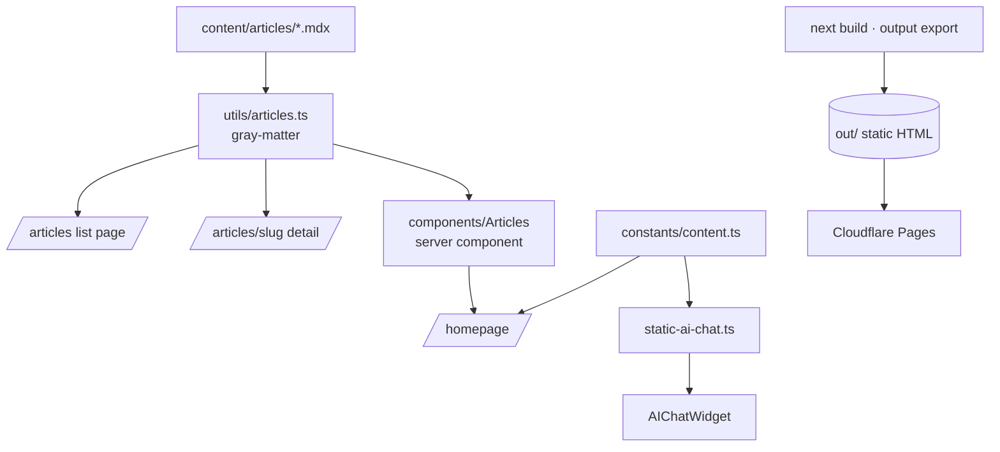

# Arsitektur & Struktur Data

Dokumen ini menjelaskan struktur repository, alur rendering, dan model data dari seluruh konten di website.

## 1. Struktur Repository

```
ditazain.site/
├── content/
│   └── articles/                  # Sumber artikel (MDX + frontmatter)
│       └── *.mdx                  # 12 artikel
├── docs/                          # Dokumentasi
│   ├── PRD.md                     # Product Requirements Document
│   ├── architecture.md            # File ini
│   ├── testing.md                 # Panduan testing
│   ├── articles-system.md         # Sistem artikel MDX
│   └── homepage-articles.md       # Section Latest Articles
├── public/                        # Aset statis (avatar, cv.pdf, logo, foto)
├── scripts/
│   ├── test-static-ai-chat.ts     # Unit test jawaban AI statis
│   └── serve-out.mjs              # Static server untuk out/ (dipakai Playwright)
├── tests/
│   └── e2e/site.spec.ts           # E2E Playwright (desktop + mobile)
├── src/
│   ├── app/                       # Next.js App Router
│   │   ├── layout.tsx             # Root layout + metadata + no-flash dark mode + AIChatWidget
│   │   ├── globals.css            # Tailwind v4 (CSS-first) + theme tokens + keyframes
│   │   ├── (common)/page.tsx      # Homepage (server component)
│   │   ├── about/page.tsx         # About
│   │   ├── data/page.tsx          # Data Engineering showcase
│   │   ├── projects/page.tsx
│   │   ├── articles/page.tsx      # List artikel
│   │   ├── articles/[slug]/page.tsx  # Detail artikel (SSG)
│   │   ├── readlist/page.tsx
│   │   └── uses/page.tsx
│   ├── components/                # Komponen UI (barrel di index.ts)
│   │   ├── Navbar.tsx             # Nav sticky + mobile menu
│   │   ├── AIChatWidget/          # Chat statis floating
│   │   ├── Articles/              # index (server) + ArticlesList (client)
│   │   ├── CodeBlock/             # Blok kode + tombol copy (dipakai /data)
│   │   ├── Mermaid/               # Render diagram Mermaid (client)
│   │   ├── PhotoGallery/          # Galeri foto (mobile friendly)
│   │   ├── Projects/  Readlist/  Uses/  Socmed/  Footer/
│   │   ├── DarkModeToggle/        # Toggle tema (lazy init, no flash)
│   │   ├── ResumeButton/          # Tombol + modal preview CV
│   │   └── WhatsNewModal.tsx      # Changelog
│   ├── constants/content.ts       # TITLE, DESCRIPTION, ROLES, CURRENT_ROLE, LOCATION
│   ├── utils/
│   │   ├── articles.ts            # Baca & parse MDX (fs + gray-matter)
│   │   ├── static-ai-chat.ts      # Mesin jawaban AI rule-based
│   │   └── cn.tsx                 # clsx + tailwind-merge
│   └── contexts/audioContext.tsx  # (tersedia, belum dipakai aktif)
├── eslint.config.mjs              # ESLint 9 flat config (eslint-config-next)
├── postcss.config.mjs             # @tailwindcss/postcss
├── playwright.config.ts           # 2 project: desktop & mobile
├── next.config.mjs                # output: "export", images.unoptimized
└── .github/workflows/deploy.yml   # Lint → unit test → build → Cloudflare Pages
```

## 2. Alur Rendering & Data



**Prinsip kunci:** karena `output: "export"`, **tidak ada API route runtime**. Semua data dibaca **saat build** (server components membaca file MDX), lalu di-render menjadi HTML statis.

## 3. Model Data

### 3.1 Article (`src/utils/articles.ts`)
Dibaca dari frontmatter MDX.

```ts
interface Article {
  title: string;        // judul
  description: string;  // ringkasan / SEO (≤160 char)
  date: string;         // "YYYY-MM-DD"
  readTime: string;     // mis. "8 min read"
  tags: string[];       // mis. ["Data", "SQL"]
  slug: string;         // = nama file tanpa .mdx
  content: string;      // body markdown/MDX
}
```
- `getAllArticles(): Article[]` — semua artikel, diurutkan `date` desc.
- `getArticleBySlug(slug): Article | null` — satu artikel.

### 3.2 Konten profil (`src/constants/content.ts`)
```ts
TITLE: string;          // headline hero
DESCRIPTION: string;    // paragraf hero
ROLES: string[];        // ["Software Engineer", "Data Engineer"]
CURRENT_ROLE: { title: string; company: string; since: string };
LOCATION: string;
```

### 3.3 Experience (`src/app/about/page.tsx`)
```ts
type Experience = {
  title: string;
  company: string;
  period: string;        // mis. "Jan 2026 - Present"
  location: string;
  description: string | null;
  achievements: string[];
};
```
Entri teratas: **Technical Product Specialist — Indivara Group (Jan 2026 - Present)**. Periode Delman dikoreksi menjadi **Sept 2024 - Dec 2025**.

### 3.4 Skill groups (`about`) & Data Stack (`/data`)
```ts
type SkillGroup = { label: string; icon: ReactNode; skills: string[] };
type StackColumn = { group: string; items: string[] };
```

### 3.5 Project (`src/components/Projects/index.tsx`)
```ts
type Project = {
  title: string;
  description: string;
  technologies: string[];
  link: string;
  status: "Completed" | "In Progress" | "Ongoing";
  category: "Data Engineering" | "Software Engineering";
};
```

### 3.6 Reading list (`src/components/Readlist/index.tsx`)
```ts
type Book = {
  title: string; author: string; description: string;
  link: string; rating: number;        // 0–5 (mendukung setengah bintang)
  readTime: string; category: string;
  status: "Completed" | "Currently Reading" | "Want to Read";
};
```

### 3.7 Uses (`src/components/Uses/index.tsx`)
```ts
type UsesCategory = {
  title: string; icon: ReactNode;
  items: { name: string; description: string; link: string }[];
};
```

### 3.8 Social media (`src/components/Socmed/index.tsx`)
```ts
type Social = { name: string; icon: ReactNode; url: string };
// GitHub, LinkedIn, X, Instagram (inline SVG), Email (mailto)
```

### 3.9 AI Chat statis (`src/utils/static-ai-chat.ts`)
- `STATIC_CHAT_SUGGESTIONS: string[]` — pertanyaan starter.
- `getStaticAIReply(question: string): string` — cocokkan keyword → balasan.
- Intent: greeting, **data engineering**, profil, pengalaman, skill, project, komunitas, CV, kontak, artikel, hire, dengan fallback.

### 3.10 Changelog (`src/components/WhatsNewModal.tsx`)
```ts
type Update = { date: string; items: string[] };
```

## 4. Sistem Tema (Dark Mode)

- Strategi **class-based** (`.dark` di `<html>`), dideklarasikan di `globals.css` lewat `@custom-variant dark`.
- Inline script di `layout.tsx` `<head>` memasang class `dark` sebelum paint (mencegah flash) berdasarkan `localStorage.theme` atau `prefers-color-scheme`.
- `DarkModeToggle` membaca state awal secara lazy dari DOM (tanpa `setState` di effect) dan menulis ke `localStorage`.

## 5. Styling (Tailwind v4)

- Tanpa `tailwind.config.ts`; konfigurasi berbasis CSS di `globals.css` (`@theme`, `@plugin`, `@custom-variant`).
- PostCSS memakai `@tailwindcss/postcss`.
- Plugin typography untuk konten MDX (`prose`).

## 6. Build & Deploy

1. `next build` (Turbopack) → static export ke `out/`.
2. Halaman `articles/[slug]` di-SSG via `generateStaticParams()`.
3. GitHub Actions (`develop`): **lint → unit test → build → deploy `out/` ke Cloudflare Pages**.
